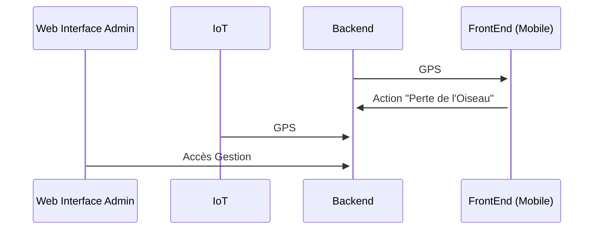
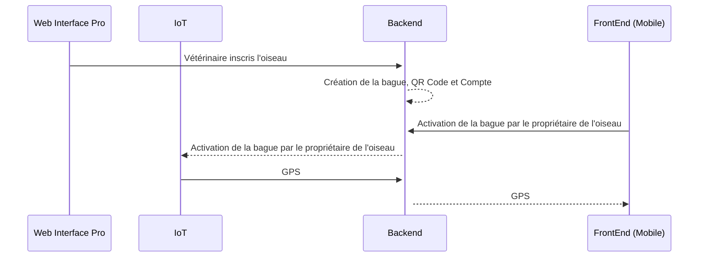
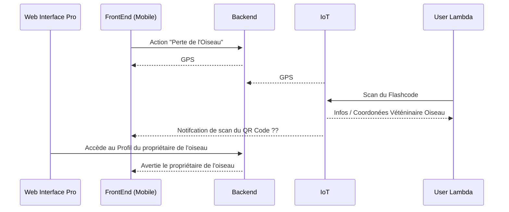

# 📘 Fonctions Principales de l'Application Peekaboo

## 1. Schéma UML : Fonctionnement global (perte et GPS)

## 2. Création du profil et Suivi de l'oiseau GPS

## 3. Déclaration de la Perte de l'Oiseau

> Le vétérinaire appelle l’utilisateur ou une notification sur le QR Code s'affiche lors du scan par un tiers.  
> L'utilisateur récupère son oiseau.
