# 📘 Fonctions Principales de l'Application Peekaboo

## 1. Schéma UML : Fonctionnement global (perte et GPS)

```mermaid
sequenceDiagram
participant  Web  Interface  Admin
participant  IoT
participant  Backend
participant  FrontEnd (Mobile)

Backend->>+FrontEnd (Mobile): GPS
FrontEnd (Mobile)->>+Backend: Action "Perte de l'Oiseau"
IoT->>+Backend: GPS
Web  Interface  Admin->>+Backend: Accès Gestion
```

## 2. Création du profil et Suivi de l'oiseau GPS

```mermaid
sequenceDiagram
participant  Web  Interface  Pro
participant  IoT
participant  Backend
participant  FrontEnd (Mobile)

Web  Interface  Pro->>+Backend: Vétérinaire inscris l'oiseau
Backend-->>Backend: Création de la bague, QR Code et Compte
FrontEnd (Mobile)->>+Backend: Activation de la bague par le propriétaire de l'oiseau
Backend-->>IoT: Activation de la bague par le propriétaire de l'oiseau
IoT->>+Backend: GPS
Backend-->>FrontEnd (Mobile): GPS
```

## 3. Déclaration de la Perte de l'Oiseau

```mermaid
sequenceDiagram
participant  Web  Interface  Pro
participant  FrontEnd (Mobile)
participant  Backend
participant  IoT
participant  User Lambda

FrontEnd (Mobile)->>+Backend: Action "Perte de l'Oiseau"
Backend-->>FrontEnd (Mobile): GPS
IoT-->>Backend: GPS
User Lambda->>+IoT: Scan du Flashcode
IoT-->>User Lambda: Infos / Coordonées Véténinaire Oiseau
IoT-->>FrontEnd (Mobile): Notifcation de scan du QR Code ??
Web  Interface  Pro->>+Backend: Accède au Profil du propriétaire de l'oiseau
Backend-->>FrontEnd (Mobile): Avertie le propriétaire de l'oiseau
```

> Le vétérinaire appelle l’utilisateur ou une notification sur le QR Code s'affiche lors du scan par un tiers.  
> L'utilisateur récupère son oiseau.
