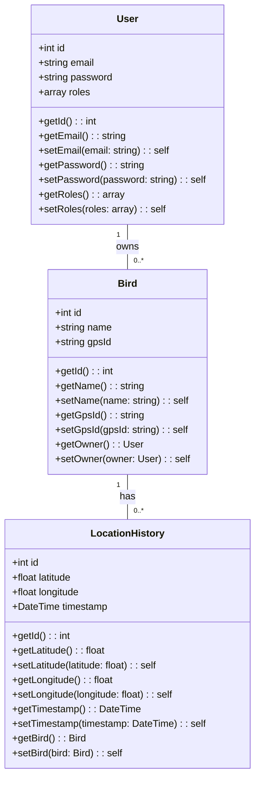

# 📘 Architecture et Modélisation des Données de Peekaboo

## 1. Relations clés

- **User ↔ Bird** : Un utilisateur peut posséder plusieurs oiseaux.
- **Bird ↔ LocationHistory** : Chaque oiseau peut avoir plusieurs points de localisation.
- **LocationHistory** : Historique des mouvements GPS, enrichi avec date/heure et coordonnées.

> Cette modélisation reflète une structure simple et extensible pour le suivi et la gestion des oiseaux.

## 2. Diagramme des classes - Structure des entités principales

