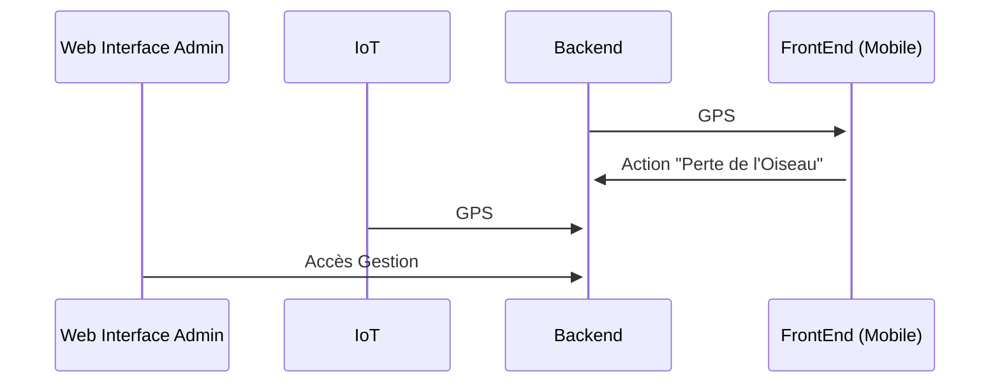
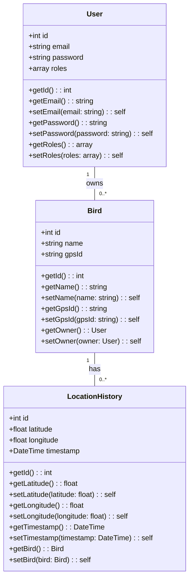
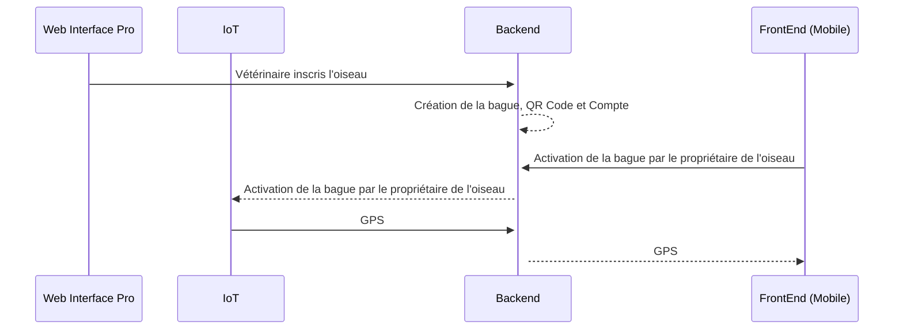
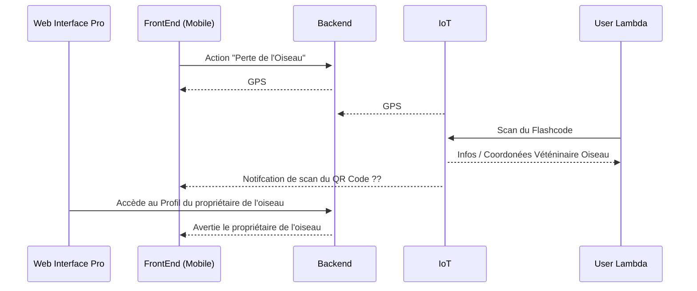

# Peekaboo
## Structure Générale

## Modélisation des données

## Fonctions Principales

### Création du profil et Suivi de l'oiseau GPS

### Perte de l'Oiseau

Le Vétérinaire appelle l'utilisateur ou notifiaction sur le QR Code lors du SCan par l'User Lambda.
L' utlisateur va récupérer son oiseau.

