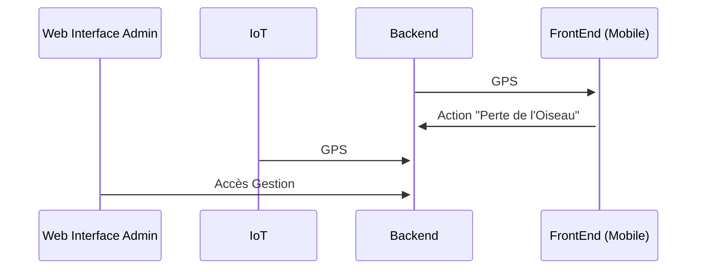
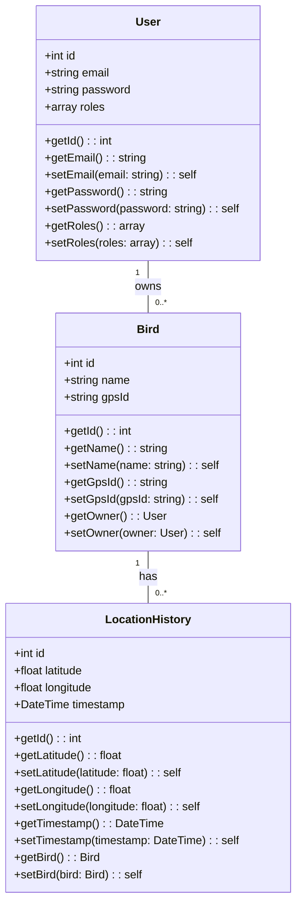
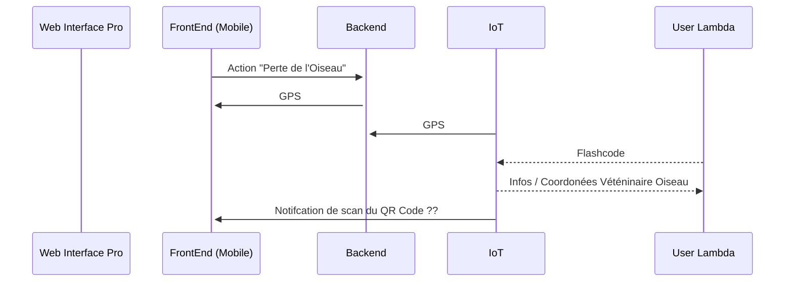

# Peekaboo
## Structure Générale

```mermaid
sequenceDiagram
participant  Web  Interface  Admin
participant  IoT
participant  Backend
participant  FrontEnd (Mobile)

Backend->>+FrontEnd (Mobile): GPS
FrontEnd (Mobile)->>+Backend: Action "Perte de l'Oiseau"
IoT->>+Backend: GPS
Web  Interface  Admin->>+Backend: Accès Gestion
```

## Modélisation des données

```mermaid
classDiagram
    class User {
        +int id
        +string email
        +string password
        +array roles
        +getId(): int
        +getEmail(): string
        +setEmail(email: string): self
        +getPassword(): string
        +setPassword(password: string): self
        +getRoles(): array
        +setRoles(roles: array): self
    }

    class Bird {
        +int id
        +string name
        +string gpsId
        +getId(): int
        +getName(): string
        +setName(name: string): self
        +getGpsId(): string
        +setGpsId(gpsId: string): self
        +getOwner(): User
        +setOwner(owner: User): self
    }

    class LocationHistory {
        +int id
        +float latitude
        +float longitude
        +DateTime timestamp
        +getId(): int
        +getLatitude(): float
        +setLatitude(latitude: float): self
        +getLongitude(): float
        +setLongitude(longitude: float): self
        +getTimestamp(): DateTime
        +setTimestamp(timestamp: DateTime): self
        +getBird(): Bird
        +setBird(bird: Bird): self
    }

    User "1" -- "0..*" Bird : owns
    Bird "1" -- "0..*" LocationHistory : has

```
## Fonctions Principales

### Perte de l'Oiseau

```mermaid
sequenceDiagram
participant  Web  Interface  Pro
participant  FrontEnd (Mobile)
participant  Backend
participant  IoT
participant  User Lambda

FrontEnd (Mobile)->>+Backend: Action "Perte de l'Oiseau"
Backend->>+FrontEnd (Mobile): GPS
IoT->>+Backend: GPS
User Lambda-->>IoT: Flashcode
IoT-->>User Lambda: Infos / Coordonées Véténinaire Oiseau
IoT->>+FrontEnd (Mobile): Notifcation de scan du QR Code ??
```
L' utlisateur va récupérer son oiseau.

### Suivi de l'oiseau en Vol Libre 

```mermaid
sequenceDiagram
participant  Web  Interface  Admin
participant  IoT
participant  Backend
participant  FrontEnd (Mobile)

Backend->>+FrontEnd (Mobile): GPS
FrontEnd (Mobile)->>+Backend: Action "Perte de l'Oiseau"
IoT->>+Backend: GPS
Web  Interface  Admin->>+Backend: Accès Gestion
```
