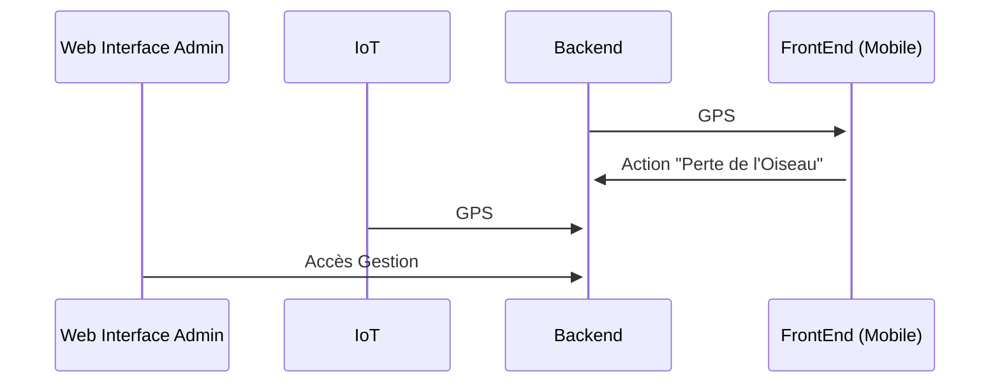
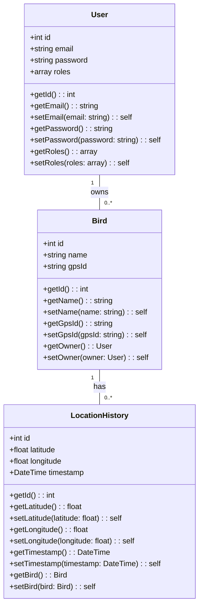
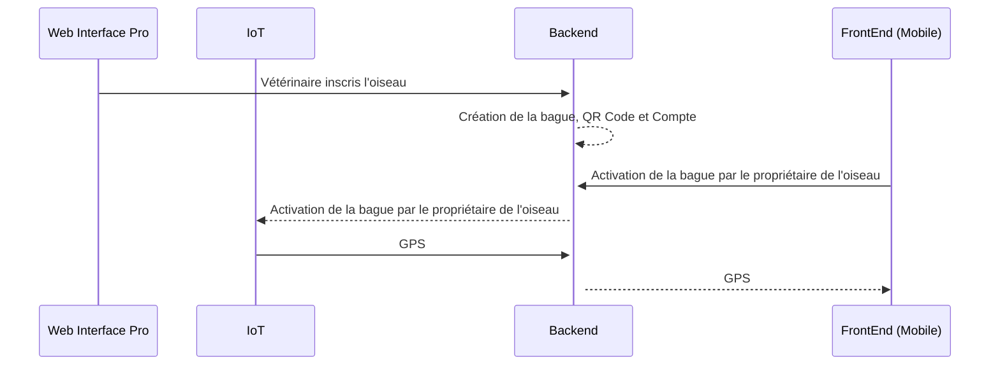
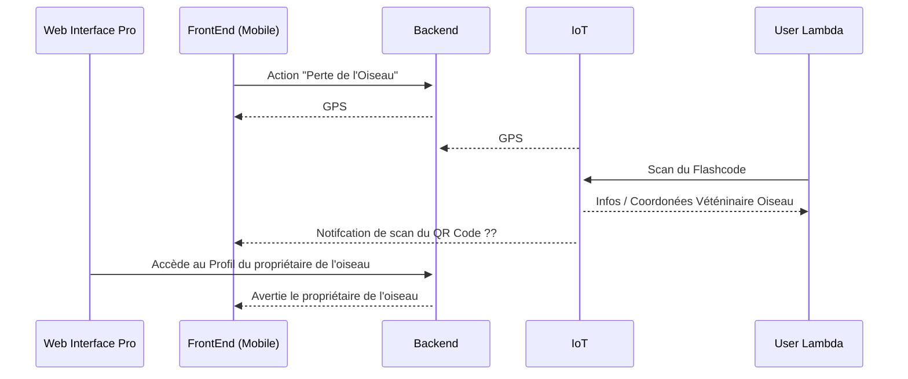

# Peekaboo
## Structure Générale


## Modélisation des données


## Fonctions Principales

### Création du profil et Suivi de l'oiseau GPS



### Perte de l'Oiseau

Le Vétérinaire appelle l'utilisateur ou notification sur le QR Code lors du scan par l'User Lambda.
L' utlisateur va récupérer son oiseau.

### Specifications API (Généré par gpt4o)

```yaml
openapi: "3.0.0"
info:
  title: Bird Tracking API
  version: "1.0.0"
  description: API for managing birds, their location histories, and user authentication.
servers:
  - url: http://localhost

paths:
  /birds:
    get:
      summary: Get All Birds
      description: Retrieves a list of all birds.
      responses:
        "200":
          description: Successful operation
          content:
            application/json:
              schema:
                type: array
                items:
                  $ref: '#/components/schemas/Bird'

  /user/{userId}/birds:
    get:
      summary: Get Birds for a Specific User
      description: Retrieves all birds owned by a given user.
      parameters:
        - name: userId
          in: path
          required: true
          schema:
            type: integer
      responses:
        "200":
          description: List of birds for the user.
          content:
            application/json:
              schema:
                type: array
                items:
                  $ref: '#/components/schemas/Bird'
        "404":
          description: User not found.
          content:
            application/json:
              schema:
                type: object
                properties:
                  error:
                    type: string
                    example: "User not found"

  /bird/{gpsId}/locations:
    post:
      summary: Update Bird Locations
      description: Updates the location of a bird identified by its GPS ID.
      parameters:
        - name: gpsId
          in: path
          required: true
          schema:
            type: string
      requestBody:
        description: An object containing an array of location updates.
        required: true
        content:
          application/json:
            schema:
              type: object
              required:
                - locations
              properties:
                locations:
                  type: array
                  items:
                    $ref: '#/components/schemas/LocationUpdate'
      responses:
        "200":
          description: Locations updated successfully.
          content:
            application/json:
              schema:
                type: object
                properties:
                  message:
                    type: string
                    example: "Locations updated successfully"
        "400":
          description: Invalid payload.
          content:
            application/json:
              schema:
                type: object
                properties:
                  error:
                    type: string
                    example: "Invalid payload"
        "404":
          description: Bird not found.
          content:
            application/json:
              schema:
                type: object
                properties:
                  error:
                    type: string
                    example: "Bird not found"

  /bird/{id}/location:
    get:
      summary: Get Last Location of a Bird
      description: Retrieves the most recent location for the specified bird.
      parameters:
        - name: id
          in: path
          required: true
          schema:
            type: integer
      responses:
        "200":
          description: Last location found.
          content:
            application/json:
              schema:
                $ref: '#/components/schemas/Location'
        "404":
          description: Bird or location history not found.
          content:
            application/json:
              schema:
                type: object
                properties:
                  error:
                    type: string
                    example: "Bird not found"  # or "No location history found for this bird"

  /bird/{id}/path:
    get:
      summary: Get Bird's Path (Location History)
      description: Retrieves the complete ordered location history for a specified bird.
      parameters:
        - name: id
          in: path
          required: true
          schema:
            type: integer
      responses:
        "200":
          description: Location history retrieved successfully.
          content:
            application/json:
              schema:
                type: array
                items:
                  $ref: '#/components/schemas/Location'
        "404":
          description: Bird not found.
          content:
            application/json:
              schema:
                type: object
                properties:
                  error:
                    type: string
                    example: "Bird not found"

  /login:
    post:
      summary: User Login
      description: Authenticates a user and returns a JWT token.
      requestBody:
        description: User credentials.
        required: true
        content:
          application/json:
            schema:
              type: object
              required:
                - email
                - password
              properties:
                email:
                  type: string
                  example: "user@example.com"
                password:
                  type: string
                  example: "yourpassword"
      responses:
        "200":
          description: Login successful.
          content:
            application/json:
              schema:
                type: object
                properties:
                  token:
                    type: string
                    example: "eyJhbGciOiJIUzI1NiIsInR5cCI6IkpXVCJ9..."
        "401":
          description: Invalid credentials.
          content:
            application/json:
              schema:
                type: object
                properties:
                  error:
                    type: string
                    example: "Invalid credentials"

  /register:
    post:
      summary: User Registration
      description: Registers a new user.
      requestBody:
        description: User registration data.
        required: true
        content:
          application/json:
            schema:
              type: object
              required:
                - email
                - password
              properties:
                email:
                  type: string
                  example: "user@example.com"
                password:
                  type: string
                  example: "yourpassword"
      responses:
        "201":
          description: User registered successfully.
          content:
            application/json:
              schema:
                type: object
                properties:
                  message:
                    type: string
                    example: "User registered successfully"
        "400":
          description: Missing email or password.
          content:
            application/json:
              schema:
                type: object
                properties:
                  error:
                    type: string
                    example: "Email and password are required"

components:
  schemas:
    Bird:
      type: object
      properties:
        id:
          type: integer
          example: 1
        name:
          type: string
          example: "Sparrow"
        latitude:
          type: number
          format: float
          example: 40.7128
        longitude:
          type: number
          format: float
          example: -74.0060
        owner:
          type: string
          description: Username of the bird owner.
          example: "user@example.com"
        gps_id:
          type: string
          example: "ABC123"
    Location:
      type: object
      properties:
        latitude:
          type: number
          format: float
          example: 40.7128
        longitude:
          type: number
          format: float
          example: -74.0060
        timestamp:
          type: string
          format: date-time
          example: "2025-03-31 12:34:56"
    LocationUpdate:
      type: object
      properties:
        latitude:
          type: number
          format: float
          example: 40.7128
        longitude:
          type: number
          format: float
          example: -74.0060
    User:
      type: object
      properties:
        id:
          type: integer
          example: 1
        email:
          type: string
          example: "user@example.com"
        password:
          type: string
          description: Hashed password.
          example: "$2y$10$..."
        roles:
          type: array
          items:
            type: string
          example:
            - "ROLE_USER"
```


