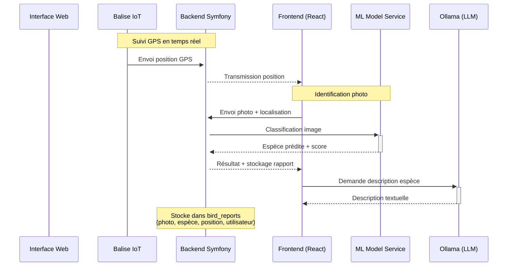
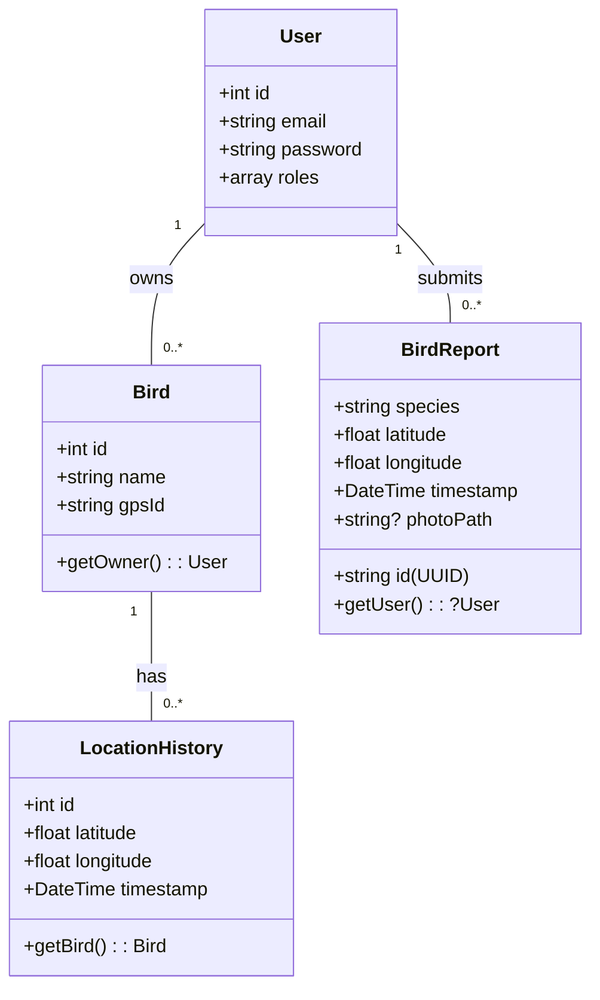

# 🐦 Peekaboo — Application de Suivi et d'Observation d'Oiseaux

**Peekaboo** est une plateforme complète de suivi d'oiseaux combinant :
- **Suivi GPS** via balises IoT pour les oiseaux équipés
- **Carte collaborative** des observations photo par les utilisateurs
- **Identification par IA** (reconnaissance d'espèces via modèle ML)
- **Chat ornithologique** (LLM Ollama) pour descriptions d'espèces

---

## 📋 Table des matières

1. [Architecture globale](#-architecture-globale)
2. [Services](#-services)
3. [Prérequis](#-prérequis)
4. [Installation et démarrage](#-installation-et-démarrage)
5. [Développement](#-développement)
6. [Fonctionnalités](#-fonctionnalités)
7. [API REST](#-api-rest)
8. [Modèle de données](#-modèle-de-données)
9. [Structure du projet](#-structure-du-projet)

---

## 🏗 Architecture globale


```mermaid
sequenceDiagram
    participant Web as Interface Web
    participant IoT as Balise IoT
    participant Backend as Backend Symfony
    participant Front as Frontend (React)
    participant ML as ML Model Service
    participant LLM as Ollama (LLM)

    Note over IoT,Backend: Suivi GPS en temps réel
    IoT->>+Backend: Envoi position GPS
    Backend-->>Front: Transmission position

    Note over Front,ML: Identification photo
    Front->>+Backend: Envoi photo + localisation
    Backend->>+ML: Classification image
    ML-->>-Backend: Espèce prédite + score
    Backend-->>Front: Résultat + stockage rapport
    Front->>+LLM: Demande description espèce
    LLM-->>-Front: Description textuelle

    Note over Backend: Stocke dans bird_reports<br/>(photo, espèce, position, utilisateur)
```

### Flux Docker

```
┌───────────────┐     ┌──────────────────┐     ┌──────────────────┐
│  Frontend     │────▶│  Backend Symfony │────▶│  PostgreSQL      │
│  React/Vite   │     │  PHP 8.1 Apache  │     │                  │
│  Port 8010    │     │  Port 8000       │     │  Port 5435       │
└───────┬───────┘     └────────┬─────────┘     └──────────────────┘
        │                      │
        │                      ▼
        │              ┌──────────────────┐     ┌──────────────────┐
        │              │  ML Model Flask  │     │  Ollama LLM      │
        └──────────────│  Port 8060       │     │  Port 11434      │
                       └──────────────────┘     └──────────────────┘
```

---

## 🧩 Services

| Service | Technologie | Port | Rôle |
|---|---|---|---|
| **Frontend** | React 18 + TypeScript + Vite | `8010` | Interface utilisateur, carte Leaflet, upload photo |
| **Backend** | Symfony 6 + PHP 8.1 Apache | `8000` | API REST, authentification JWT, base de données |
| **Base de données** | PostgreSQL 14 | `5435` | Stockage des données (oiseaux, utilisateurs, localisations) |
| **ML Model** | Python Flask | `8060` | Classification d'espèces par image |
| **Ollama LLM** | llama3.2:3b | `11434` | Génération de descriptions ornithologiques |
| **Mover** | Python script | — | Simulateur IoT : envoie des positions GPS à intervalle régulier |

---

## 📦 Prérequis

- [Docker](https://docs.docker.com/get-docker/) & [Docker Compose](https://docs.docker.com/compose/install/)
- **8 Go de RAM minimum** (Ollama + models)
- **Node.js 22** (si développement frontend hors Docker)

---

## 🚀 Installation et démarrage

### 1. Cloner le projet

```bash
git clone <url-du-repo> Peekabo
cd Peekabo/peekaboback
```

### 2. Lancer tous les services

```bash
docker compose up --build -d
```

Cela démarre les 6 services : `front`, `app`, `db`, `peekaboo_class_model_service`, `ollama`, `mover`.

### 3. Vérifier que tout fonctionne

```bash
# Statut des conteneurs
docker compose ps

# Logs du backend
docker compose logs app

# Logs du frontend
docker compose logs front
```

### 4. Accéder à l'application

| Interface | URL |
|---|---|
| **Frontend** | [http://localhost:8010](http://localhost:8010) |
| **API Backend** | [http://localhost:8000](http://localhost:8000) |

### 5. Migrations et fixtures

Les migrations et fixtures s'exécutent automatiquement au démarrage du conteneur Symfony via `docker/init.sh`. Pour les relancer manuellement :

```bash
docker compose exec app php bin/console doctrine:migrations:migrate
docker compose exec app php bin/console doctrine:fixtures:load
```

---

## 🛠 Développement

### Frontend (React + Vite)

```bash
cd peekabofront
npm install
npm run dev
```

Le frontend est accessible sur `http://localhost:8010`.  
Toutes les requêtes API (`/predict`, `/bird_reports`, `/llm`, etc.) sont proxyfiées vers le backend Symfony via `vite.config.ts`.

### Backend (Symfony)

```bash
docker compose exec app bash
php bin/console cache:clear
php bin/console debug:router  # liste les routes disponibles
```

### Modèle ML

```bash
# Logs du service de classification
docker compose logs peekaboo_class_model_service
```

---

## ✨ Fonctionnalités

### 🗺 Carte interactive (Leaflet)

- **Suivi GPS** des oiseaux équipés de balises (position en temps réel, historique du trajet)
- **Signalements collaboratifs** : points rouges sur la carte pour les observations photo des utilisateurs
- Popup avec : espèce, horaire, photo miniature, email du contributeur

### 📷 Identification par photo

1. Charger une photo d'oiseau
2. Le backend transmet l'image au service ML (Python/Flask)
3. Le modèle retourne l'espèce avec un score de confiance
4. **Si confiance < 30 %** → affiche "Oiseau Non reconnu" (aucun signalement stocké)
5. **Si confiance ≥ 30 %** → stocke le signalement avec photo et localisation GPS
6. Une description de l'espèce est générée via Ollama (LLM)

### 🤖 Chat ornithologique

Assistant IA spécialisé en ornithologie, basé sur Ollama (llama3.2:3b), accessible depuis la page Chat.

### 📋 Listes dépliantes

- **Liste des oiseaux** : oiseaux suivis avec leurs positions
- **Signalements** : toutes les observations photo avec miniature, espèce et horaire

---

## 🌐 API REST

### Authentification

| Méthode | Route | Description |
|---|---|---|
| POST | `/login` | Authentification utilisateur (retourne un JWT) |
| POST | `/register` | Création de compte |

### Oiseaux

| Méthode | Route | Description |
|---|---|---|
| GET | `/birds` | Liste de tous les oiseaux |
| GET | `/user/birds` | Oiseaux de l'utilisateur connecté |

### Localisations

| Méthode | Route | Description |
|---|---|---|
| POST | `/bird/{gpsId}/locations` | Envoi de positions GPS (IoT) |
| GET | `/bird/{id}/location` | Dernière position d'un oiseau |
| GET | `/bird/{id}/path` | Historique complet des positions |

### Signalements collaboratifs

| Méthode | Route | Description |
|---|---|---|
| POST | `/predict` | Classification photo + stockage signalement |
| GET | `/bird_reports` | Liste de tous les signalements |
| GET | `/bird_report/{id}/photo` | Photo du signalement |

### IA

| Méthode | Route | Description |
|---|---|---|
| POST | `/llm/get-chat-birds/` | Description ornithologique (SSE stream) |
| POST | `/llm/chat` | Chat généraliste (SSE stream) |

### Proxy Vite (dev)

Le `vite.config.ts` proxyfie les routes suivantes vers le backend Symfony :
`/predict`, `/bird_reports`, `/bird/`, `/birds`, `/llm`, `/user`, `/login`, `/register`, `/bird_report/`

---

## 💾 Modèle de données


```mermaid
classDiagram
    class User {
        +int id
        +string email
        +string password
        +array roles
    }

    class Bird {
        +int id
        +string name
        +string gpsId
        +getOwner(): User
    }

    class LocationHistory {
        +int id
        +float latitude
        +float longitude
        +DateTime timestamp
        +getBird(): Bird
    }

    class BirdReport {
        +string id (UUID)
        +string species
        +float latitude
        +float longitude
        +DateTime timestamp
        +string? photoPath
        +getUser(): ?User
    }

    User "1" -- "0..*" Bird : owns
    Bird "1" -- "0..*" LocationHistory : has
    User "1" -- "0..*" BirdReport : submits
```

### Entités

| Entité | Table | Description |
|---|---|---|
| **User** | `users` | Utilisateurs (propriétaires d'oiseaux) |
| **Bird** | `birds` | Oiseaux suivis, avec `gps_id` pour la balise IoT |
| **LocationHistory** | `location_history` | Points GPS reçus des balises |
| **BirdReport** | `bird_reports` | Signalements photo collaboratifs (UUID, espèce, position, photo) |

---

## 📁 Structure du projet

```
Peekabo/
├── peekaboback/              # Backend Symfony (PHP 8.1)
│   ├── config/               # Configuration Symfony
│   ├── docker/               # Script init.sh (démarrage conteneur)
│   ├── migrations/           # Migrations Doctrine
│   ├── src/
│   │   ├── Controller/       # Contrôleurs (Classification, Bird, ...)
│   │   ├── Entity/           # Entités Doctrine (Bird, BirdReport, User...)
│   │   └── Repository/       # Repositories Doctrine
│   ├── public/               # Web root (Apache)
│   ├── var/                  # Cache, logs, uploads photos
│   ├── docker-compose.yml    # Orchestration complète
│   └── Dockerfile
│
├── peekabofront/             # Frontend React + Vite
│   ├── src/
│   │   ├── components/       # Composants (BirdList, BirdReportsList)
│   │   ├── pages/            # Pages (Camera, Map, Chat, Auth...)
│   │   ├── api/              # Types générés
│   │   └── auth/             # Contexte d'authentification
│   ├── vite.config.ts        # Configuration Vite + proxy
│   └── Dockerfile.front
│
├── peekaboo_class_model_service/  # Service ML Python Flask
├── ollama/                   # Script d'initialisation Ollama
├── ollama-data/              # Données persistantes Ollama
└── python/                   # Scripts Python auxiliaires
```

---

## 🔧 Commandes utiles

```bash
# Reconstruire et relancer tous les services
docker compose up --build -d

# Voir les logs d'un service
docker compose logs -f front app db

# Exécuter une commande dans un conteneur
docker compose exec app bash
docker compose exec front sh

# Appliquer les migrations
docker compose exec app php bin/console doctrine:migrations:migrate

# Vider le cache Symfony
docker compose exec app php bin/console cache:clear

# Arrêter tous les services
docker compose down

# Supprimer les volumes (perte de données)
docker compose down -v
```

---

## 📄 Documents complémentaires

- [Spécification API détaillée](./2326-07_specification_api_Peekaboo.md)
- [Fonctions principales](./2326-07_peekaboo_fonctions_principales.md)
- [Modélisation des données](./2326-07_peekaboo_modelisation_donnees.md)
